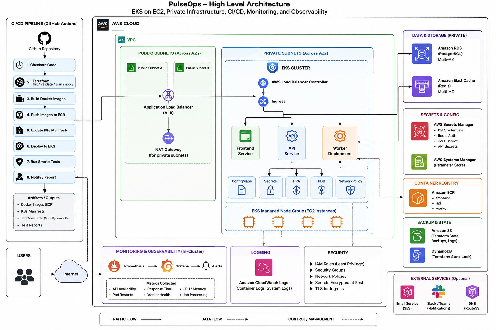

# PulseOps Platform

PulseOps is an asynchronous job-processing platform built for the DevOps and Platform Engineering assessment.

## End-to-end flow



```text
User
  -> AWS Application Load Balancer
  -> React + Nginx
  -> FastAPI Backend
       -> RDS PostgreSQL
       -> Amazon SQS
  -> Kubernetes Worker
       -> PostgreSQL
       -> ElastiCache Redis
```

The backend persists a job, publishes it to SQS and returns HTTP 202. The worker processes the message asynchronously, updates PostgreSQL and caches the result in Redis.

## Repository

```text
pulseops-platform/
├── backend/
├── frontend/
├── worker/
├── infrastructure/
│   ├── terraform/
│   └── kubernetes/
├── docs/
└── README.md
```

## Main technologies

AWS VPC, EKS, ALB, ECR, RDS PostgreSQL, ElastiCache Redis, SQS, Secrets Manager, IAM, Terraform, Kubernetes, GitHub Actions, React, Nginx, FastAPI, SQLAlchemy and Alembic.

See `docs/` for architecture and operational documentation.
