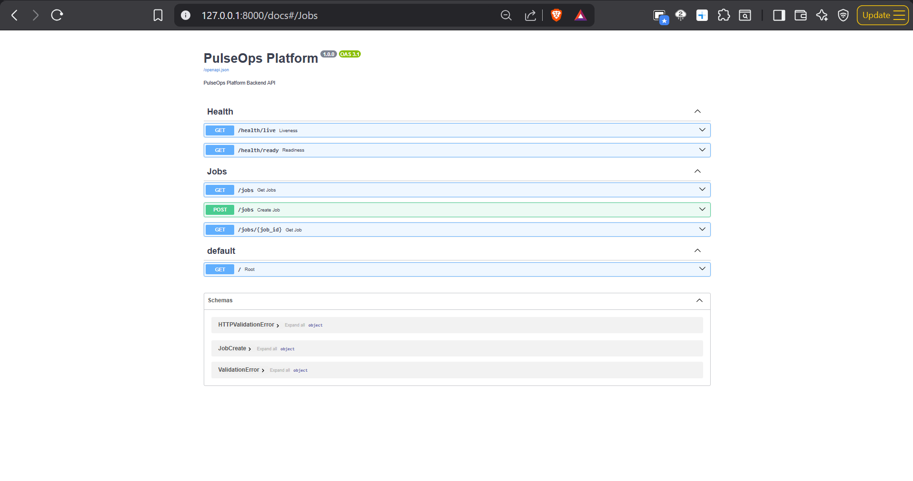

# PulseOps Platform - Backend

## Overview

The backend is a lightweight FastAPI-based REST API responsible for accepting job requests, managing job lifecycle, exposing health endpoints, and coordinating asynchronous processing using Amazon SQS, Amazon RDS PostgreSQL, and Amazon ElastiCache Redis.

The backend follows a production-oriented architecture with a clear separation between API handling, background workers, persistent storage, and caching.

---



---

## Tech Stack

- Python 3.12+
- FastAPI
- Uvicorn
- SQLAlchemy
- PostgreSQL (Amazon RDS)
- Amazon SQS
- Amazon ElastiCache Redis
- Pydantic
- Python Dotenv
- Docker

---

## Features

- RESTful API
- OpenAPI (Swagger UI)
- Health Checks
- Job Submission API
- Job Status API
- PostgreSQL Integration
- Amazon SQS Integration
- Redis Caching
- Environment Variable Configuration
- Docker Ready
- Kubernetes Ready

---

## Project Structure

```
backend/
│
├── api/
│   ├── app/
│   │   ├── routes/
│   │   │   ├── health.py
│   │   │   └── jobs.py
│   │   │
│   │   ├── config.py
│   │   ├── database.py
│   │   ├── models.py
│   │   ├── schemas.py
│   │   └── main.py
│   │
│   ├── requirements.txt
│   ├── Dockerfile
│   ├── .env.example
│   └── README.md
│
└── worker/
    ├── worker.py
    ├── requirements.txt
    ├── Dockerfile
    └── .env.example
```

---

## Backend Workflow

```
Client

↓

POST /jobs

↓

FastAPI

↓

Store Job Metadata

↓

Amazon RDS PostgreSQL

↓

Send Job ID

↓

Amazon SQS Queue

↓

Return HTTP 202 Accepted
```

Worker Flow

```
Worker

↓

Poll Amazon SQS

↓

Receive Job

↓

Fetch Job Details

↓

Process Job

↓

Update PostgreSQL

↓

Update Redis Cache

↓

Delete SQS Message
```

Read Flow

```
Frontend

↓

GET /jobs/{id}

↓

FastAPI

↓

Redis Cache

↓

Cache Hit?
│
├── Yes
│     ↓
│   Return Response
│
└── No
      ↓
Amazon RDS PostgreSQL

↓

Populate Redis

↓

Return Response
```

---

## API Endpoints

| Method | Endpoint      | Description                |
| ------ | ------------- | -------------------------- |
| GET    | /             | API Information            |
| GET    | /health/live  | Kubernetes Liveness Probe  |
| GET    | /health/ready | Kubernetes Readiness Probe |
| POST   | /jobs         | Submit a New Job           |
| GET    | /jobs         | List All Jobs              |
| GET    | /jobs/{id}    | Retrieve Job Details       |

---

## Environment Variables

Create a `.env` file from `.env.example`.

```env
APP_NAME=PulseOps Platform
APP_ENV=development

HOST=0.0.0.0
PORT=8000

POSTGRES_HOST=
POSTGRES_PORT=5432
POSTGRES_DB=
POSTGRES_USER=
POSTGRES_PASSWORD=

REDIS_HOST=
REDIS_PORT=6379

SQS_QUEUE_URL=

AWS_REGION=ap-south-1

LOG_LEVEL=INFO
```

---

## Install Dependencies

Create Virtual Environment

```bash
python -m venv venv
```

Activate

### Windows

```bash
venv\Scripts\activate
```

### Linux

```bash
source venv/bin/activate
```

Install Dependencies

```bash
pip install -r requirements.txt
```

---

## Run Backend

```bash
uvicorn app.main:app --reload
```

Backend will be available at

```
http://localhost:8000
```

---

## Swagger Documentation

Open

```
http://localhost:8000/docs
```

OpenAPI Specification

```
http://localhost:8000/openapi.json
```

---

## Job Lifecycle

```
QUEUED

↓

PROCESSING

↓

COMPLETED
```

Possible Failure State

```
FAILED
```

---

## AWS Services Used

- Amazon Elastic Kubernetes Service (EKS)
- Amazon RDS PostgreSQL
- Amazon SQS
- Amazon ElastiCache Redis
- Amazon Elastic Container Registry (ECR)
- AWS Secrets Manager
- AWS Identity and Access Management (IAM)
- Amazon CloudWatch

---

## Health Checks

### Liveness Probe

```
GET /health/live
```

Returns

```json
{
  "status": "alive"
}
```

---

### Readiness Probe

```
GET /health/ready
```

Returns

```json
{
  "status": "ready"
}
```

Future implementations will validate

- PostgreSQL Connectivity
- Redis Connectivity
- Amazon SQS Connectivity

---

## Docker

Build

```bash
docker build -t pulseops-api .
```

Run

```bash
docker run -p 8000:8000 pulseops-api
```

---

## Security

- Environment Variables
- AWS Secrets Manager
- IAM Roles
- Kubernetes Secrets
- Private Networking
- Least Privilege Access

---

## Logging

Application logs are written to stdout and are collected by Kubernetes.

Cloud-native logging is integrated with

- Amazon CloudWatch
- Prometheus
- Grafana

---

## Current Status

✔ FastAPI Application

✔ REST APIs

✔ Swagger Documentation

✔ Health Endpoints

✔ Job APIs

✔ Modular Project Structure

✔ Environment Configuration

✔ Docker Ready

---

## Planned Improvements

- Amazon RDS Integration
- Amazon SQS Integration
- Amazon ElastiCache Redis Integration
- Background Worker
- Retry Mechanism
- Dead Letter Queue (DLQ)
- Structured Logging
- Metrics Endpoint
- Distributed Tracing
- Prometheus Monitoring
- Grafana Dashboards
