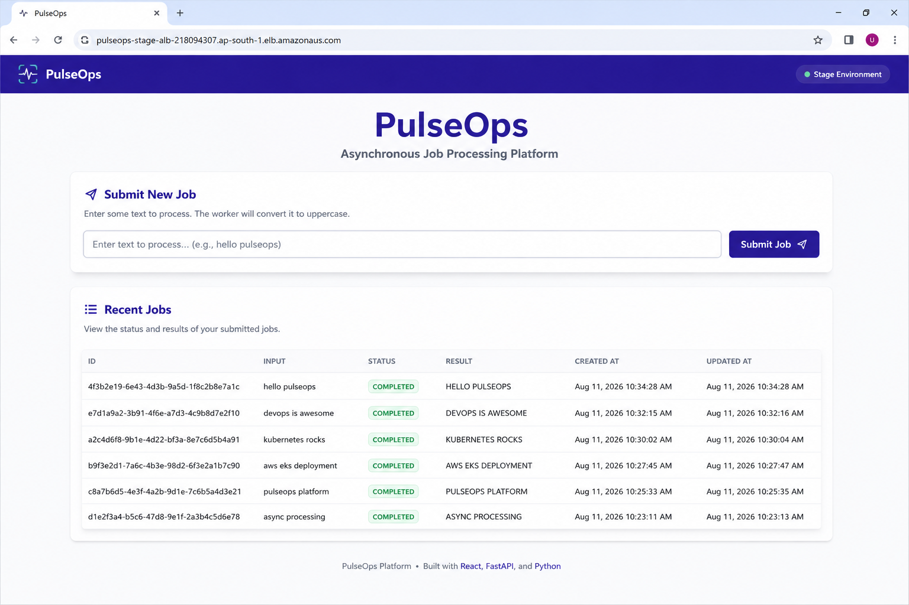

# Frontend

React application served by Nginx.



## API

The frontend service layer provides:

- `submitJob(text)`
- `getJobs()`
- `getJob(jobId)`

Primary endpoints:

```text
POST /jobs
GET /jobs
GET /jobs/{jobId}
```

## Container

A Node builder creates the production bundle and an Nginx runtime serves it.

Nginx serves the SPA, provides fallback routing, serves static assets and proxies `/jobs` to the internal backend service.
